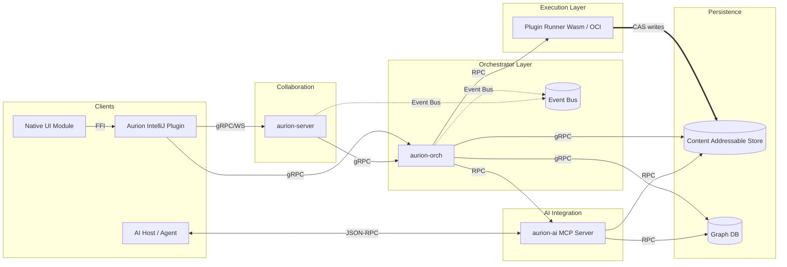
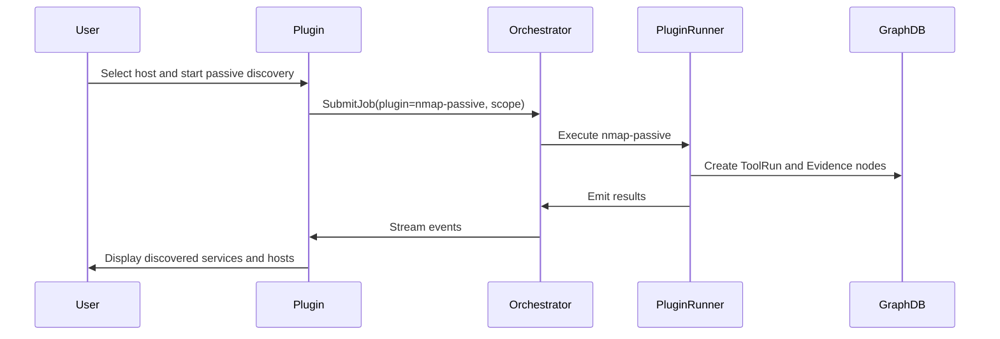
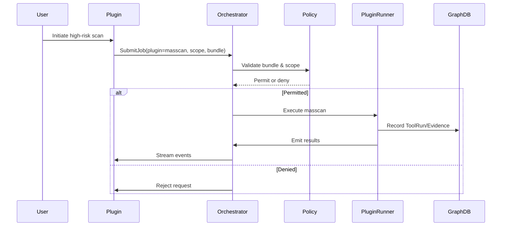
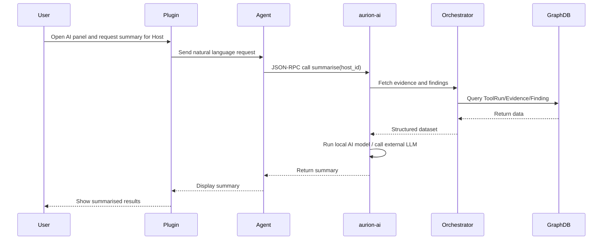

# Architecture

Aurion consists of four core processes – the IDE client (implemented as a JetBrains IntelliJ plugin with an optional native module), an orchestrator, a collaboration server and an **AI/MCP server** – together with a graph database, artifact storage and plugin runners.  The system is written primarily in Rust and communicates internally over Protobuf/gRPC.  A dedicated AI/MCP server exposes Aurion’s capabilities to AI agents via the open-source Model Context Protocol, enabling native summarisation and classification features.  The diagram below shows the top-level components and their interactions.

## Component responsibilities

* **IntelliJ Plugin (aurion‑plugin)**: Presents the graph explorer UI, runbook builder, report generator, AI chat panel and plugin marketplace inside IntelliJ IDEA.  The plugin communicates with the orchestrator and server over gRPC and WebSockets.  It uses JetBrains UI components and JCEF WebViews to render the graph, and never executes untrusted code itself.  A built‑in **MCP client** connects to the AI server when the user invokes summarisation or runbook suggestions.

* **Native UI Module**: Optional Rust component compiled as a shared library and loaded by the IntelliJ plugin to provide high‑performance rendering, native AI inference or OS‑specific integrations.  It exposes a minimal FFI surface and communicates with the plugin using serialised messages.

* **Orchestrator (aurion‑orch)**: Coordinates plugin execution, caching, rate‑limiting, policy enforcement and AI task orchestration.  It exposes RPC endpoints for submitting jobs, retrieving results and requesting AI services.  The orchestrator writes all state into the graph database and CAS.

* **Collaboration server (aurion‑server)**: Manages user sessions, workspaces and event streaming.  It maintains the authoritative graph and arbitrates concurrent edits.  Peer‑to‑peer CRDTs are considered future work; the initial design is centralised.  The server also brokers authentication tokens for AI clients and applies per‑workspace permissions.

* **AI/MCP server (aurion‑ai)**: Implements the Model Context Protocol (MCP).  MCP is an open‑source standard for connecting AI applications to external systems; it enables AI agents like Claude or ChatGPT to access data sources, tools and workflows through a unified interface【65787800937560†L60-L69】.  The AI server exposes Aurion’s tools and data as MCP actions so that AI agents can request summarisation, classification or runbook generation.  It communicates with the orchestrator, graph database and CAS and runs local AI models or forwards requests to external LLM endpoints as configured.  The server validates *AuthorizationBundle* policies before performing any active actions.

* **Graph database**: Stores all entities as nodes and relationships.  The Neo4j property graph model uses labels and key–value properties on nodes and edges【780551429696953†L227-L250】.  An adapter layer abstracts Neo4j/Memgraph and SurrealDB.

* **Content Addressable Store (CAS)**: Holds immutable blobs such as tool outputs, reports and attachments.  The CAS uses BLAKE3 digests【518711832070345†L37-L41】 as keys and may back onto the local filesystem or an S3‑compatible bucket.  Entries include a provenance record linking them back to `ToolRun` nodes.

* **Plugin Runner**: Executes plugins in a Wasm/WASI sandbox using Wasmtime【801025589620893†L83-L112】.  When Wasm is not viable, an OCI container is launched with seccomp and AppArmor profiles to restrict syscalls.  The runner streams normalised events to the orchestrator.

## Data flow

The orchestrator exposes a simple RPC for submitting jobs.  A job includes the plugin name, version, configuration, target scope and an optional *AuthorizationBundle* for gated capabilities.  The orchestrator computes a deterministic cache key (see `PLUGINS.md`) and checks the graph for a prior identical run.  On cache miss, it invokes the plugin runner.  Emitted events are stored in the CAS and the corresponding graph nodes (`ToolRun`, `Evidence`, `Finding`) are created.

## Passive pipeline run

Passive runs gather information without transmitting packets beyond DNS and HTTP resolution.  The sequence below illustrates a typical flow when an operator triggers a passive run on a host:

## Active gated run

Active operations (e.g., port scans, brute‑force or vulnerability scanning) require authorisation.  The orchestrator enforces policies by verifying the submitted *AuthorizationBundle* before any packets are sent.

## Data retention and CAS

All plugin outputs are stored in the CAS keyed by the BLAKE3 digest of the content.  Evidence nodes in the graph reference CAS entries.  Retention policies can be configured per workspace; by default, CAS objects are immutable and retained indefinitely, while graph nodes may be pruned after an engagement is closed.  A garbage collector periodically removes unreachable CAS blobs.

## AI capabilities and MCP flow

The AI/MCP server enables Aurion to provide intelligent summarisation, classification and runbook suggestions.  The sequence below illustrates a typical flow when a user asks the AI agent to summarise recent findings:

The AI server can perform classification of new evidence, generate natural language runbooks and answer questions about the current engagement.  Active operations invoked via AI still require an *AuthorizationBundle*; the AI server validates capabilities before forwarding requests to the orchestrator.

## Acceptance Criteria

This architecture document includes a top‑level Mermaid diagram showing the system with the AI/MCP server, textual descriptions of component responsibilities (including the AI server), descriptions of data flows and sequence diagrams for passive, active and AI flows.  It describes the CAS design, mentions the graph database model and references authoritative sources for MCP【65787800937560†L60-L69】【772482920673209†L56-L83】.  There are at least three sequence diagrams (passive, active and AI) and one graph diagram.