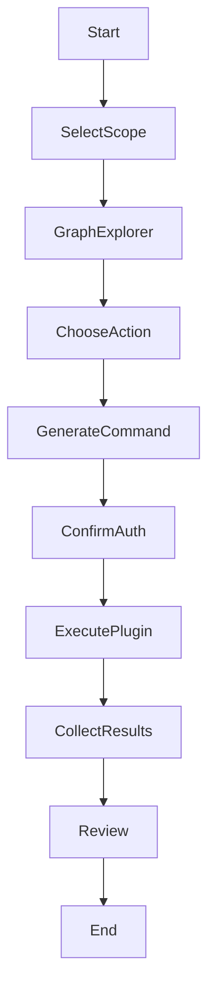

# UX Specification

Aurion emphasises an exploratory workflow over script writing.  Operators interact with a live graph to decide what to do next.  This section specifies the UX behaviours, context resolution, command generation and runbook flows.

## Graph explorer

The central UI element is the **graph explorer**.  Nodes representing hosts, services, tool runs and findings are rendered interactively.  Right-clicking on a node opens a context menu with actions applicable to the node type.  For example:

- On a **Host**: actions include “Run nmap passive scan”, “Run HTTP probe” and “Open terminal”.
- On a **Service**: actions include “Run vulnerability scan” or “Fuzz paths”.
- On a **Finding**: actions include “Mark resolved”, “Add note” and “Generate report”.

Double-clicking a node focuses it and reveals its properties in a side pane.  Hovering over an edge displays relationship metadata.

## Ambient context resolver

When the operator selects multiple nodes, the IDE maintains an **ambient context stack**.  This context informs plugins about the target.  The resolver algorithm picks the most specific elements (service over host over scope).  A simplified pseudo-code is:

```rust
fn resolve_context(selection: &[GraphNode]) -> Context {
    let mut context = Context::default();
    for node in selection.iter().rev() { // newest selection wins
        match node.label.as_str() {
            "Service" => {
                context.port = node.properties.get("port");
                context.protocol = node.properties.get("protocol");
                context.host_ip = node.parent("Host").and_then(|h| h.properties.get("ip"));
            }
            "Host" => {
                context.host_ip = node.properties.get("ip");
            }
            "Scope" => {
                context.scope_id = node.properties.get("id");
            }
            _ => {}
        }
    }
    context
}
```

The context has a time-to-live (TTL) of 5 minutes.  After the TTL expires the stack is cleared to prevent accidental reuse of stale parameters.

## Command generation templates

Plugins provide templated command strings using the [Tera](https://tera.netlify.app/) syntax.  The orchestrator injects the resolved context.  Examples:

- **nmap passive scan**:

  ```text
  nmap -sV -Pn -n -oX {{ output }} {{ host_ip }}
  ```

- **httpx probe**:

  ```text
  httpx-toolkit -t 50 -title -status-code -location -silent -json -o {{ output }} {{ host_ip }}
  ```

- **ffuf directory fuzz**:

  ```text
  ffuf -u http://{{ host_ip }}:{{ port }}/FUZZ -w {{ wordlist }} -t 40 -c -of json -o {{ output }}
  ```

The IDE renders a preview of the generated command for confirmation.  If the command contains high-risk actions, the UI prompts for an *AuthorizationBundle*.

## Runbook flows

Runbooks allow users to chain multiple plugin executions into a reproducible sequence.  A runbook is defined in YAML or through the GUI.  The following flowchart shows the runbook execution lifecycle:



## Acceptance Criteria

This UX document describes graph explorer behaviours, right-click actions, the ambient context resolver with pseudo-code, command generation templates using Tera and a runbook flowchart.  TTL defaults and confirmation prompts are specified.  At least one Mermaid flowchart is provided.
